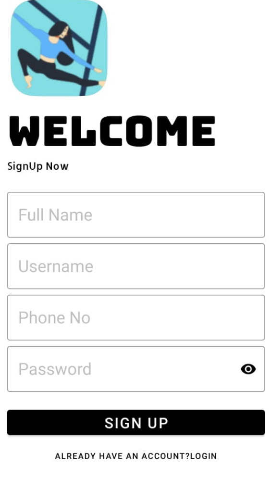
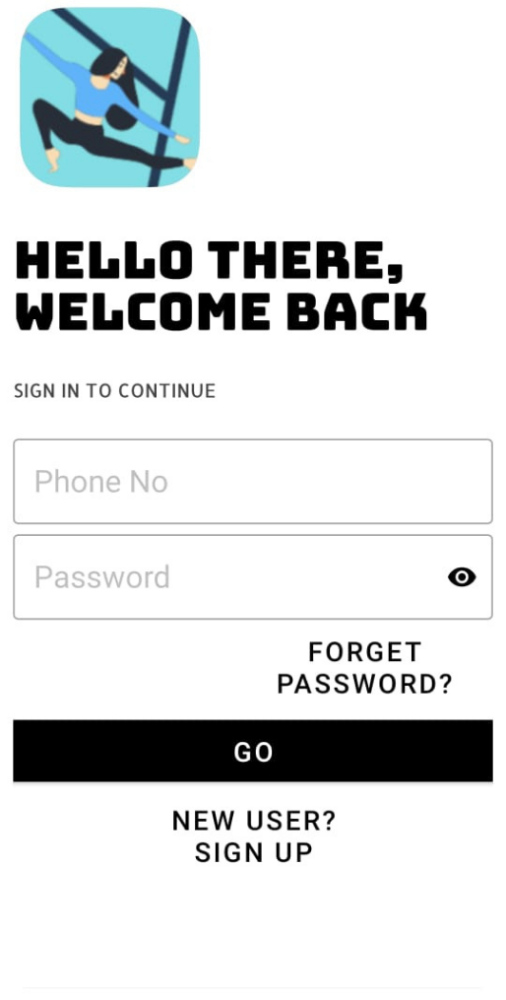
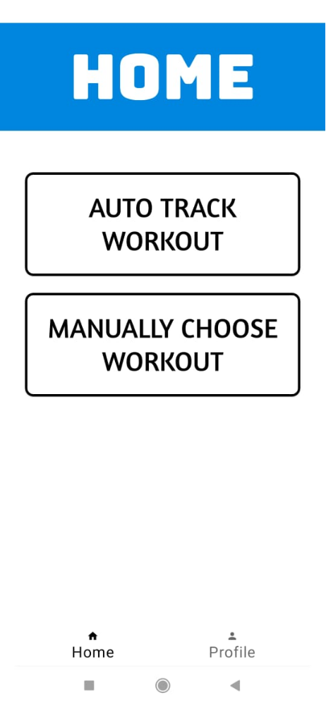
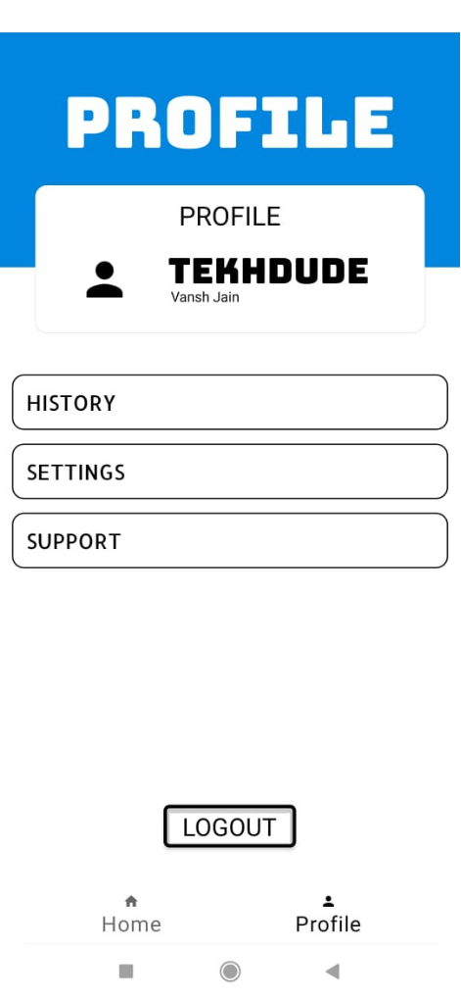
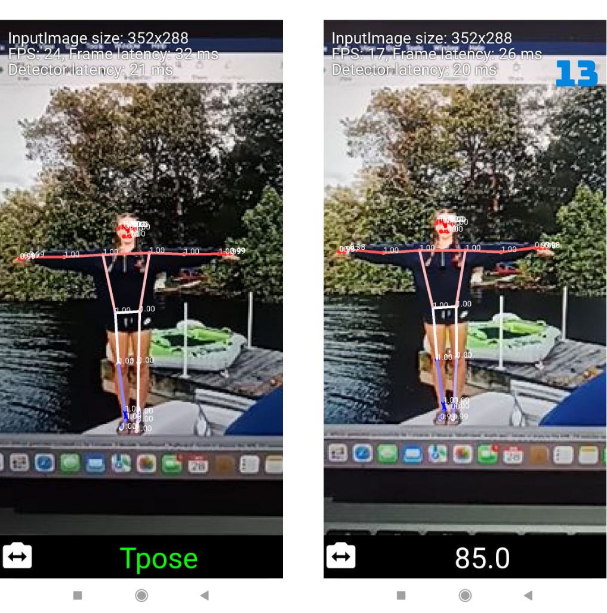
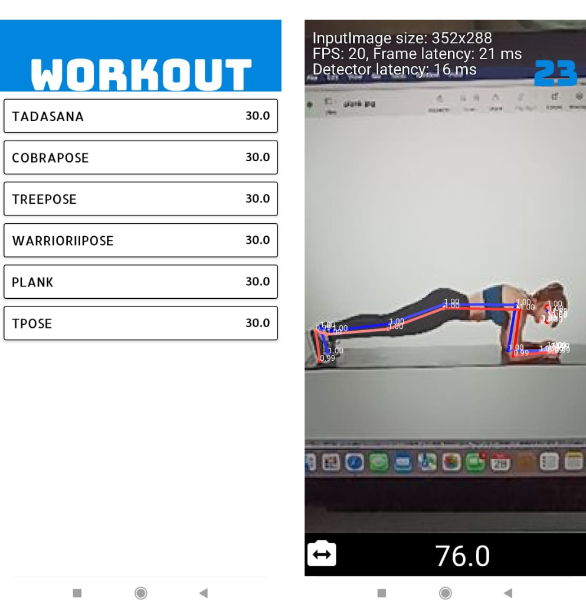

# Yogify

An Android app that uses real-time body landmark detection to identify the yoga pose a user is performing, score its accuracy against a reference pose, and visually guide them toward the correct asana.

## Overview

Yogify points the phone's camera at the user during a yoga session and:

- Detects body landmarks (joints) in real time using the camera feed.
- Classifies which pose is being held and how accurately, by comparing joint angles (elbow, shoulder, knee) against a reference pose dataset.
- Overlays the detected skeleton on screen and gives visual feedback so the user can self-correct their form.
- Tracks workouts and user accounts through a simple login/sign-up flow.

## Features

- **Real-time pose detection** — live skeletal landmark tracking via the camera feed, rendered as an on-screen overlay.
- **Pose classification & accuracy scoring** — joint angles are computed from detected landmarks and matched against a bundled reference dataset (`app/src/main/res/dataset.csv`) to identify the pose and how closely it matches correct form.
- **Auto-tracking & timers** — the workout flow confirms a pose is being held and can time it.
- **Voice interaction** — microphone permission is requested for speech-based interaction during a session.
- **User accounts** — login/sign-up screens backed by Firebase.
- **Workout history** — a dedicated workout screen and data model for tracking sessions over time.

## Screenshots

**App flow** — sign up, log in, choose a workout mode, and check your profile:

| Sign Up | Login | Home | Profile |
|---|---|---|---|
|  |  |  |  |

From Home, a workout can be started in one of two modes:

**Auto Track Workout** — the app detects the pose being held and classifies it automatically (here, a T-pose recognized at 85.0% accuracy):



**Manually Choose Workout** — the user picks a specific pose (e.g. Plank) from the list, and the app scores form against that target pose (76.0% accuracy shown):



## Tech Stack

- **Platform:** Android (Java), minSdk 21, compileSdk 31
- **Pose detection:** [Google ML Kit Pose Detection](https://developers.google.com/ml-kit/vision/pose-detection) (base + accurate models) via CameraX
- **Computer vision:** OpenCV, bundled as a local `OpenCV4` Gradle module (native C++ via the Android NDK)
- **Backend:** Firebase (Realtime Database, Analytics)
- **Build:** Gradle / Android Gradle Plugin 7.1.0

The pose classification pipeline (`posedetector/classification/`) — pose embedding, EMA smoothing, repetition counting — follows the structure of Google's official ML Kit pose classification sample, adapted here for yoga asana accuracy scoring instead of exercise rep counting.

> The repo also includes a standalone Python module (`app/src/main/python/main.py`) implementing the same angle-based classification logic using OpenCV/pandas/TensorFlow. It's kept as a reference/prototyping script — the app's build isn't configured to run Python on-device, so pose classification at runtime happens in the Java pipeline described above.

## Project Structure

```
app/src/main/java/.../miniproject_yogify/
├── MainActivity.java, LoginPage.java, SignUpPage.java   Entry point & auth
├── Home.java, mainmenu.java                             Navigation
├── PoseDetectStart.java, Workout.java                   Pose-detection session flow
├── CameraSource.java, CameraSourcePreview.java, ...      Camera pipeline (CameraX)
├── posedetector/
│   ├── PoseDetectorProcessor.java, PoseGraphic.java      ML Kit pose overlay
│   └── classification/                                   Pose classification (embedding, smoothing, rep counting)
└── preference/                                            App settings

app/src/main/python/main.py    Standalone Python prototype (reference only)
app/src/main/res/dataset.csv   Reference pose dataset used for accuracy scoring
OpenCV4/                       Bundled OpenCV Android module (native C++/NDK)
```

## Getting Started

1. Open the project in Android Studio (Arctic Fox or later) and let Gradle sync.
2. Set up your own Firebase project and replace `app/google-services.json` with your project's config file — the one checked in is tied to the original Firebase project.
3. Build and run on a device or emulator with a camera (API 21+).
4. Grant the camera, microphone, and storage permissions when prompted.

## Permissions

| Permission | Why |
|---|---|
| `CAMERA` | Real-time pose detection from the live camera feed |
| `RECORD_AUDIO` | Voice interaction during a workout session |
| `READ/WRITE_EXTERNAL_STORAGE` | Reading/saving workout-related data |
| `INTERNET` | Firebase (auth, database, analytics) |
